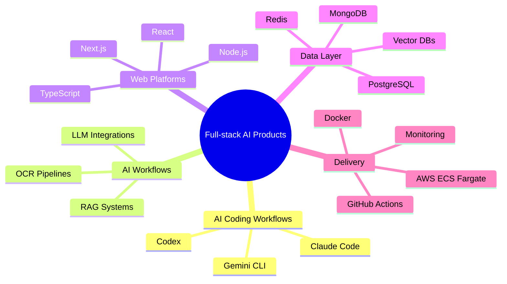

<div align="center">


<a href="mailto:ayushjha3108@gmail.com"></a>
<a href="https://github.com/Ak07-cyber"></a>
<a href="https://www.linkedin.com/in/kumar-ayush-jha0007"></a>

<br />


<br />
<br />


</div>

---

## About Me

I am a Computer Science and Engineering student specializing in AI and ML at Chennai Institute of Technology, with a CGPA of **8.87 / 10**. I build scalable web applications using **React, Node.js, TypeScript, PostgreSQL, MongoDB**, and cloud-native deployment workflows.

My work sits at the intersection of full-stack engineering and applied AI: LLM integrations, semantic search, OCR pipelines, RAG-style retrieval, secure APIs, containerized services, and production-focused CI/CD.

```txt
Current focus     Full-stack AI products, GenAI APIs, RAG, cloud deployments
Core stack        React, Next.js, Node.js, TypeScript, PostgreSQL, MongoDB
DevOps tools      Docker, Docker Compose, GitHub Actions, AWS ECS Fargate
AI experience     OpenAI, Gemini API, embeddings, vector databases
AI coding tools   Claude Code, Codex, Gemini CLI
```

---

## Tech Stack

<table width="100%">
  <tr>
    <th align="left">Area</th>
    <th align="left">Tools</th>
  </tr>
  <tr>
    <td width="22%"><strong>Languages</strong></td>
    <td>
       &nbsp;
       &nbsp;
       &nbsp;
      
    </td>
  </tr>
  <tr>
    <td><strong>Frontend</strong></td>
    <td>
       &nbsp;
       &nbsp;
       &nbsp;
       &nbsp;
      
    </td>
  </tr>
  <tr>
    <td><strong>Backend</strong></td>
    <td>
       &nbsp;
       &nbsp;
       &nbsp;
       &nbsp;
      
    </td>
  </tr>
  <tr>
    <td><strong>Databases</strong></td>
    <td>
       &nbsp;
       &nbsp;
       &nbsp;
       &nbsp;
      
    </td>
  </tr>
  <tr>
    <td><strong>Cloud and DevOps</strong></td>
    <td>
       &nbsp;
       &nbsp;
       &nbsp;
       &nbsp;
      
    </td>
  </tr>
  <tr>
    <td><strong>AI Tools</strong></td>
    <td>
       &nbsp;
       &nbsp;
       &nbsp;
       &nbsp;
       &nbsp;
      
    </td>
  </tr>
  <tr>
    <td><strong>Observability</strong></td>
    <td>
       &nbsp;
       &nbsp;
      
    </td>
  </tr>
</table>

---

## GitHub Dashboard

<div align="center">


<br />
<br />


<br />
<br />


</div>

---

## Coding Profiles

<div align="center">

<a href="https://leetcode.com/u/o8A3q4UXBS/">
  
</a>

</div>

---

## What I Like Building



---

<div align="center">

### Ready to collaborate on production-ready applications.

<a href="mailto:ayushjha3108@gmail.com"></a>
<a href="https://www.linkedin.com/in/kumar-ayush-jha0007"></a>

<br />
<br />


</div>
