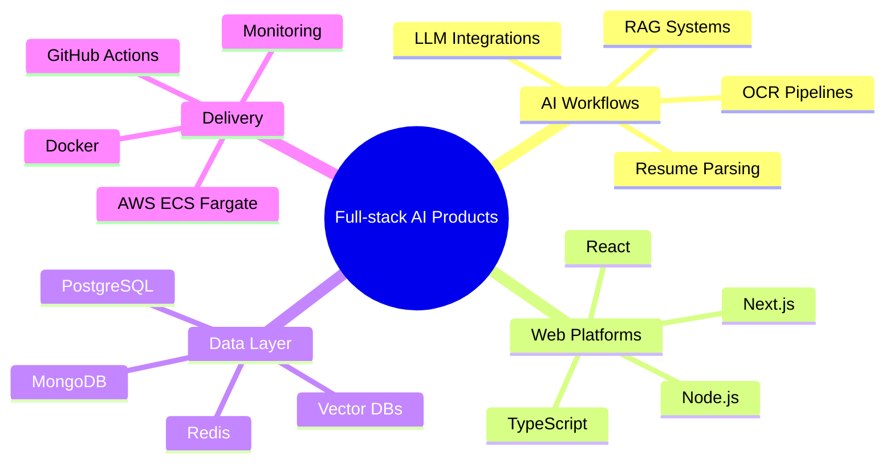

<div align="center">


<a href="mailto:ayushjha3108@gmail.com"></a>
<a href="https://github.com/Ak07-cyber"></a>
<a href="https://www.linkedin.com/in/kumar-ayush-jha0007"></a>

<br />


</div>

---

## About Me

I am a Computer Science and Engineering student specializing in AI and ML at Chennai Institute of Technology, with a CGPA of **8.87 / 10**. I build scalable web applications using **React, Node.js, TypeScript, PostgreSQL, MongoDB**, and cloud-native deployment workflows.

My work sits at the intersection of full-stack engineering and applied AI: LLM integrations, semantic search, OCR pipelines, RAG-style retrieval, secure APIs, containerized services, and production-focused CI/CD.

```txt
Current focus     Full-stack AI products, GenAI APIs, RAG, cloud deployments
Core stack        React, Next.js, Node.js, TypeScript, PostgreSQL, MongoDB
DevOps tools      Docker, Docker Compose, GitHub Actions, AWS ECS Fargate
AI experience     OpenAI, Gemini API, LLaMA 3, embeddings, vector databases
```

---

## Tech Stack

<div align="center">

| Area | Tools |
| --- | --- |
| Languages |     |
| Frontend |      |
| Backend |      |
| Databases |      |
| Cloud and DevOps |      |
| Observability |    |

</div>

---

## Featured Work

<table>
  <tr>
    <td width="50%">
      <h3>AI-Powered Interview Preparation Platform</h3>
      <p>Full-stack AI platform that generates personalized interview reports from resumes and job descriptions.</p>
      <p>
        
        
        
        
      </p>
      <p><strong>Highlights:</strong> PDF resume parsing, role-fit scores, skill-gap insights, learning roadmaps, JWT auth, Docker Compose, GitHub Actions CI.</p>
    </td>
    <td width="50%">
      <h3>BimaSarthi: AI-Powered Insurance Platform</h3>
      <p>Insurance recommendation platform that matches users with plans based on income, family profile, and financial goals.</p>
      <p>
        
        
        
        
      </p>
      <p><strong>Highlights:</strong> AI recommendation engine, OCR policy analysis, hidden-clause detection, Dockerized backend, ECS Fargate deployment.</p>
    </td>
  </tr>
  <tr>
    <td width="50%">
      <h3>Muzer: Collaborative Music Streaming Web App</h3>
      <p>Multi-room music web app where users create spaces, queue songs, vote on tracks, and play music through the YouTube API.</p>
      <p>
        
        
        
        
      </p>
      <p><strong>Highlights:</strong> Concurrent active rooms, upvote/downvote ranking, protected routes, Docker, GitHub Actions, AWS ECS Fargate.</p>
    </td>
    <td width="50%">
      <h3>Semantic Recipe Search</h3>
      <p>AI intern project using embeddings, vector DB retrieval, LLaMA 3, metadata filtering, and similarity ranking across 10K+ records.</p>
      <p>
        
        
        
      </p>
      <p><strong>Impact:</strong> Improved top-5 relevance from 61% to 72% and reduced average query latency from 320ms to 272ms.</p>
    </td>
  </tr>
</table>

---

## Experience

<details open>
<summary><strong>AI Engineer Intern - Axcord Global Pvt. Limited</strong></summary>

**May 2024 - July 2024 | Bangalore**

- Built a semantic recipe search system with embedding models and a vector database across **10K+ indexed records**.
- Integrated a **LLaMA 3** response layer to generate natural language recommendations and explanations from retrieved results.
- Improved top-5 relevance from **61% to 72%** and reduced average query latency from **320ms to 272ms**.

</details>

<details>
<summary><strong>Front-end Developer Intern - Alam Buhari Enterprise</strong></summary>

**November 2023 - December 2023**

- Built responsive web interfaces using HTML, CSS, and JavaScript across desktop and mobile.
- Improved Lighthouse Performance score from **68 to 78** through UI and asset-loading optimizations.
- Debugged cross-browser issues and improved release stability.

</details>

---

## GitHub Dashboard

<div align="center">


<br />


</div>

---

## Highlights

<details open>
<summary><strong>Achievements</strong></summary>

- **Smart India Hackathon 2024 Finalist**, representing Chennai Institute of Technology among top national teams.
- **Top Performer in Analytical Proficiency**, CDC, Chennai Institute of Technology.
- **Promotion and Social Media Lead** for a national-level technical symposium, driving digital marketing, lead generation, and strategic communications.

</details>

<details>
<summary><strong>Certifications</strong></summary>

- CCNA: Introduction to Networks
- AWS Cloud Specialization - Coursera
- AWS Fundamentals Specialization - Coursera
- AWS DevOps Engineer Professional Course - Udemy
- NPTEL: Introduction to LLMs

</details>

<details>
<summary><strong>Languages</strong></summary>

- English - Proficient
- Hindi - Native proficiency
- Tamil - Proficient
- Maithili - Native

</details>

---

## What I Like Building



---

<div align="center">

### Let us build useful AI-backed products.

<a href="mailto:ayushjha3108@gmail.com"></a>
<a href="https://www.linkedin.com/in/kumar-ayush-jha0007"></a>

<br />
<br />


</div>
